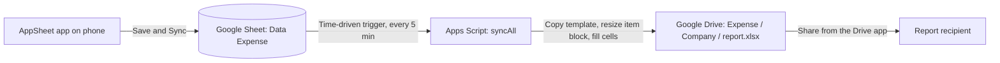

# Expense Report Pipeline

Phone-based expense reporting. AppSheet collects the income and expense items, Google Sheets stores them, and Apps Script builds one Excel report per job in Google Drive. The report has as many item rows as you enter, and the script rewrites the total formulas to match.

## Contents

1. [Overview](#1-overview)
2. [Data model](#2-data-model)
3. [Report template](#3-report-template)
4. [Setup](#4-setup)
5. [How the script works](#5-how-the-script-works)
6. [SOP: Daily use](#6-sop-daily-use)
7. [Testing](#7-testing)
8. [Troubleshooting](#8-troubleshooting)
9. [Repository hygiene](#9-repository-hygiene)
10. [Limitations and open decisions](#10-limitations-and-open-decisions)

---

## 1. Overview

A report holds the job details (company, job name, customer, date, preparer) and a variable number of items. Each item is either income (`Transfer`, `Sisa`) or an expense (`Bahan Bakar`, `Tol`, `Konsumsi`, and categories you add). Within five minutes of a sync, the script copies the template, resizes the item table, fills the cells, and saves the report as a Google Sheet and an `.xlsx` file. Send the `.xlsx` from the Google Drive app.



Drive layout produced by the script:

```
Expense/
  <Company>/
    <Company>_<Job name>_<yyyy-MM-dd>        (Google Sheet)
    <Company>_<Job name>_<yyyy-MM-dd>.xlsx   (export, sent to the recipient)
```

### Design decisions

| Decision | Reason |
|---|---|
| Items live in their own table, linked to the report | A report holds as many items as the job needs |
| Categories live in their own table | You add categories from the phone without editing the app |
| Item category is filtered by item type | Income shows `Transfer` and `Sisa`, expense shows the cost categories |
| The script rewrites the total formulas | Row numbers change with the item count, so fixed ranges point at the wrong rows |
| The script writes item dates as text | Text skips timezone conversion between the script and the sheet |
| Separate spreadsheet and script from the calibration project | The two projects do not share function names or trigger |

## 2. Data model

Google Sheet `Data Expense` has four tabs. Use the tab names and headers as written. Row 1 holds the headers.

### Tab `Laporan` (one row per report)

| Column | AppSheet type | Settings |
|---|---|---|
| `ID` | Text | Key, hidden, initial value `UNIQUEID()` |
| `Perusahaan` | Text | Require. Initial value is your default company name. Editable per report |
| `Nama Pekerjaan` | Text | Require |
| `Customer` | Text | Require |
| `Tanggal Laporan` | Date | Require, initial value `TODAY()` |
| `Dibuat Oleh` | Text | Require, initial value is the preparer name |
| `Disetujui Oleh` | Text | Optional. An empty value prints as a blank signature line |

Virtual columns on `Laporan`:

| Name | Type | Formula |
|---|---|---|
| `Total Pemasukan` | Number | `SUM(SELECT(Item[Jumlah], AND([LaporanID]=[_THISROW].[ID], [Jenis]="Pemasukan")))` |
| `Total Pengeluaran` | Number | `SUM(SELECT(Item[Jumlah], AND([LaporanID]=[_THISROW].[ID], [Jenis]="Pengeluaran")))` |
| `Selisih` | Number | `[Total Pengeluaran]-[Total Pemasukan]` |
| `Status` | Text | `IF([Selisih]>0,"REIMBURSE / KURANG",IF([Selisih]<0,"BERLEBIH / SISA","IMPAS"))` |

### Tab `Item` (one row per income or expense line)

| Column | AppSheet type | Settings |
|---|---|---|
| `ID` | Text | Key, hidden, initial value `UNIQUEID()` |
| `LaporanID` | Ref to `Laporan` | Turn on **Is a part of?** so items appear inside the report page |
| `Tanggal` | Date | Require, initial value `TODAY()` |
| `Jenis` | Enum | Values `Pemasukan`, `Pengeluaran`. Initial value `"Pengeluaran"` |
| `Kategori` | Ref to `Kategori` | Require. Valid_If: `SELECT(Kategori[Nama], [Jenis]=[_THISROW].[Jenis])` |
| `Keterangan` | Text | Require |
| `Vendor` | Text | Optional |
| `Jumlah` | Number | Require |
| `Catatan` | Text | Optional |

### Tab `Kategori` (editable category list)

| Column | AppSheet type | Settings |
|---|---|---|
| `Nama` | Text | Key |
| `Jenis` | Enum | Values `Pemasukan`, `Pengeluaran` |

Starting rows:

| Nama | Jenis |
|---|---|
| Transfer | Pemasukan |
| Sisa | Pemasukan |
| Bahan Bakar | Pengeluaran |
| Tol | Pengeluaran |
| Konsumsi | Pengeluaran |
| Parkir | Pengeluaran |
| Material & Sparepart | Pengeluaran |
| Akomodasi | Pengeluaran |

### Tab `Map` (the script creates it)

| Column | Content |
|---|---|
| `ID` | Report ID from `Laporan` |
| `FileId` | Drive ID of the Google Sheet report |
| `Signature` | MD5 hash of the report row and its items |
| `XlsxId` | Drive ID of the exported `.xlsx` |

Do not edit this tab by hand, except as described in [Troubleshooting](#8-troubleshooting).

## 3. Report template

The template is `Form_Expense_CV_Agam_Prima_Sukses_V2.xlsx` converted to a Google Sheet named `TEMPLATE Expense`, with the tab `Expense Report`.

### Cell map

| Cell | Content | Filled from |
|---|---|---|
| `A1` | Report title | `Laporan.Perusahaan` |
| `C5` | Job name | `Laporan.Nama Pekerjaan` |
| `C6` | Customer | `Laporan.Customer` |
| `C7` | Report date, for example `2 Oktober 2026` | `Laporan.Tanggal Laporan` |
| Rows 9 to 18 | Item table, 10 rows in the template | `Item` rows |
| Row 19 | Totals for `Pemasukan` (E) and `Pengeluaran` (F) | Formula |
| Row 20 | Status text (A), difference (E), helper value (G) | Formula |
| `B27` | Preparer name, printed as `( name )` | `Laporan.Dibuat Oleh` |
| `F27` | Approver name, printed as `( name )` | `Laporan.Disetujui Oleh` |

Item table columns: `No`, `Tanggal`, `Keterangan`, `Customer / Vendor`, `Pemasukan`, `Pengeluaran`, `Catatan / Bukti`.

The `Keterangan` column holds the category and the description, for example `Bahan Bakar - Isi Pertalite`. The template has no separate category column.

### Row resizing

The template ships with 10 item rows. For a report with `n` items the script:

| Case | Action |
|---|---|
| `n` above 10 | Inserts `n - 10` rows above the last item row |
| `n` below 10 | Deletes the unused rows |
| All cases | Applies the format of the first item row to all item rows, with alternating row colors |

Rows below the item table, including the merged cells and the signature block, shift with the resize.

### Formulas

With `first = 9`, `tot = 9 + n` and `st = tot + 1`, the script writes:

| Cell | Formula |
|---|---|
| `E{tot}` | `=SUM(E9:E{tot-1})` |
| `F{tot}` | `=SUM(F9:F{tot-1})` |
| `G{st}` | `=F{tot}-E{tot}` |
| `E{st}` | `=ABS(F{tot}-E{tot})` |
| `A{st}` | `IF` on `G{st}`: positive is `STATUS: REIMBURSE / KURANG`, negative is `STATUS: BERLEBIH / SISA`, zero is `STATUS: IMPAS` |

An income item fills `Pemasukan` and leaves `Pengeluaran` at 0. An expense item does the reverse.

## 4. Setup

### Part 1: Drive folder and template

1. Create the Drive folder `Expense`. Copy its ID from the address bar (the text after `/folders/`).
2. Upload `Form_Expense_CV_Agam_Prima_Sukses_V2.xlsx`. Right-click it, choose **Open with > Google Sheets**, and choose **File > Save as Google Sheets**.
3. Rename the result to `TEMPLATE Expense`. Copy its ID (the text between `/d/` and `/edit`).
4. Keep the tab name `Expense Report`. Delete the uploaded `.xlsx`.
5. In **File > Settings**, set the time zone to `(GMT+07:00) Jakarta`.

### Part 2: Google Sheet `Data Expense`

1. Create a Google Sheet named `Data Expense`.
2. Create the tabs `Laporan`, `Item` and `Kategori` with the headers from [Data model](#2-data-model).
3. Fill `Kategori` with the starting rows.
4. In **File > Settings**, set the time zone to `(GMT+07:00) Jakarta`.

### Part 3: AppSheet

1. Open the existing app and choose **Data > Tables > Add new table**. Add `Laporan`, `Item` and `Kategori` from `Data Expense`.
2. Allow **Adds** and **Updates** on all three tables. Allow **Deletes** on `Laporan` and `Item`.
3. Set the column types and settings from [Data model](#2-data-model).
4. Add the four virtual columns to `Laporan`.
5. Create a view for each table. Show `Item` rows inside the `Laporan` detail view (the **Is a part of?** setting does this).
6. Open the `Kategori` view and confirm that adding a category works from the phone.

### Part 4: Apps Script

1. In `Data Expense`, open **Extensions > Apps Script**. Delete the default code and paste the contents of [`Code.gs`](Code.gs).
2. Set `ROOT_FOLDER_ID` to the `Expense` folder ID and `TEMPLATE_ID` to the `TEMPLATE Expense` ID.
3. Open **Project Settings** and set the time zone to `Asia/Jakarta`.
4. Select `syncAll` and click **Run**. Grant access: **Advanced > Go to project (unsafe) > Allow**.
5. Open **Triggers** and choose **Add Trigger**: function `syncAll`, event source **Time-driven**, type **Minutes timer**, interval **Every 5 minutes**.

Configuration constants in `Code.gs`:

| Constant | Purpose |
|---|---|
| `ROOT_FOLDER_ID` | Drive folder `Expense` |
| `TEMPLATE_ID` | Google Sheet `TEMPLATE Expense` |
| `TEMPLATE_SHEET` | Tab name inside the template (`Expense Report`) |
| `REPORT_SHEET`, `ITEM_SHEET`, `MAP_SHEET` | Tab names in `Data Expense` |
| `EXPORT_XLSX` | `true` writes the `.xlsx` next to the Google Sheet |
| `FIRST_ITEM_ROW`, `TEMPLATE_ITEM_ROWS`, `SIGNATURE_NAME_ROW` | Template layout. Change these if the template layout changes |

## 5. How the script works

`syncAll` runs on the trigger:

1. Take a script lock so two runs do not overlap.
2. Read `Laporan` and `Item`. Load the `Map` tab.
3. For each report, collect its items and compute a hash of the report row and the item rows.
4. Skip the report if the hash matches the stored `Signature`.
5. Skip the report if `Perusahaan`, `Nama Pekerjaan` or `Tanggal Laporan` is empty, if the script cannot parse the date, or if the report has no items. A later run picks it up.
6. Build the file:
   - **New report:** copy the template into `Expense/<Company>`.
   - **Changed report:** keep the same file, so the share link stays valid. The script copies a fresh template tab into it, deletes the old tab, and fills the new tab.
7. Resize the item block, write the values, rewrite the formulas, and fill the signature block.
8. Export the `.xlsx`, move the previous export to the trash, and update the `Map` row.

If one report fails, the script logs the error and continues with the next report.

### Date handling

The script avoids JavaScript `Date` objects for display. It reads a date from the sheet as year, month and day in the spreadsheet time zone, and it parses a text date such as `15/09/2026` or `2026-09-15` from its parts. It writes the report date as long text (`2 Oktober 2026`) and item dates as text `dd/mm/yyyy`. The script time zone cannot shift a date by one day.

### Text safety

The script adds a leading apostrophe to a value that starts with `=`, `+`, `-` or `@`, so the sheet stores it as text.

## 6. SOP: Daily use

### SOP-1: Create a report

1. In the app, open `Laporan` and tap **+**.
2. Fill company, job name, customer, date and preparer. Tap **Save**.
3. Tap **Sync**.

### SOP-2: Add items

1. Open the report.
2. In the item section, tap **+**.
3. Choose `Jenis` first (`Pemasukan` or `Pengeluaran`). The `Kategori` list shows the matching categories.
4. Fill date, description, amount, and optional vendor and note. Tap **Save**.
5. Repeat for each item. The report page shows the running totals and status.
6. Tap **Sync**.

### SOP-3: Add a category

1. Open the `Kategori` view and tap **+**.
2. Enter the name and choose `Jenis`. Tap **Save**.
3. The category appears in the item form for that `Jenis`.

### SOP-4: Correct an item or the report header

1. Open the report, tap the item (or the report), and edit it.
2. Tap **Save** and tap **Sync**.
3. Within five minutes the script rebuilds the same Drive file with the new data.

### SOP-5: Send the report

1. Wait five minutes after the last sync.
2. Open the Google Drive app and go to `Expense > <Company>`.
3. Open the `.xlsx` file, check the totals and status, and tap **Share**.

### SOP-6: Remove a report

1. Delete the report in the app and sync.
2. Check the `Item` tab and delete any item rows that still carry the removed `LaporanID`.
3. Delete the Drive files by hand. The script does not delete reports.

## 7. Testing

Run these three cases after setup and after any script change. Create a report for each case and sync.

| Case | Items | Expected result |
|---|---|---|
| Fewer rows than the template | 3 | 3 item rows. Totals row follows the last item. Signature block moved up |
| Same as the template | 10 | 10 item rows. Layout identical to the template |
| More rows than the template | 12 | 12 item rows. Totals cover all 12 rows. Signature block moved down |

For each case, check:

- The title, job name, customer, date and names match the form.
- The date is the same day as in the app.
- `Pemasukan` and `Pengeluaran` totals equal the sums shown in the app.
- The status text matches the sign of the difference.
- Editing one item and syncing updates the same file, with no duplicate in Drive.

## 8. Troubleshooting

| Symptom | Cause | Fix |
|---|---|---|
| No file appears | Missing required field, no items, or no trigger | Fill `Perusahaan`, `Nama Pekerjaan`, `Tanggal Laporan`. Add one item. Check **Triggers**. Open **Executions** for errors |
| `Cannot read properties of null` in Executions | A tab name in the config does not match the sheet | Match `REPORT_SHEET`, `ITEM_SHEET` and `TEMPLATE_SHEET` to the real tab names |
| Authorization error | Script access not granted | Run `syncAll` from the editor and grant access |
| Date is one day off | Old script version, or the time zone differs between the sheet and the template | Use the current `Code.gs`. Set Jakarta time zone in `Data Expense`, in `TEMPLATE Expense`, and in the Apps Script project settings. Force a rebuild (see below) |
| A report does not rebuild after a script fix | The data and hash did not change | In the `Map` tab, clear the `Signature` cell of that report and run `syncAll` |
| A second copy of a report appears | Someone deleted the `Map` row for that report | Restore the row, or trash the older file by hand |
| Category list is empty | No `Kategori` row has the selected `Jenis`, or the Valid_If formula is missing | Add the category. Check the Valid_If formula on `Item.Kategori` |
| Totals show 0 | The sheet stores `Jumlah` as text | Set the `Jumlah` type to Number and re-enter the value |
| Manual edit in the Excel file is gone | The script rebuilds the file after each data change | Make the change in the app |
| Report title shows the default company name | The report kept the default `Perusahaan` value | Edit `Perusahaan` on the report and sync |

### Force a rebuild of one report

1. Open the `Map` tab in `Data Expense`.
2. Clear column C (`Signature`) on the row of that report.
3. In Apps Script, run `syncAll`.

## 9. Repository hygiene

| Item | Rule |
|---|---|
| `Code.gs` | Commit. Contains the folder and template IDs, which grant no access on their own |
| Real report data | Do not commit. Reports contain amounts and customer names |
| Screenshots | Blur company names, customer names and amounts before committing |
| Sharing | Share the Drive folder with the people who need the reports and give them Viewer access |

Suggested repository layout:

```
.
  README.md
  Code.gs
  template/
    Form_Expense_CV_Agam_Prima_Sukses_V2.xlsx   (blank template)
```

## 10. Limitations and open decisions

| Item | Detail |
|---|---|
| Report delay | The trigger runs every 5 minutes, so a report can lag a sync by up to 5 minutes |
| Category column | The category is part of `Keterangan`. A separate column or a per-category summary needs a template change and a change to `fillReport_` |
| Rebuild after each change | The script replaces the report tab and discards manual edits |
| Deleting reports | Deleting a report in the app leaves its Drive files in place, and orphan item rows can remain |
| Template layout | The script depends on the template cell map in [Report template](#3-report-template). If the layout changes, update the layout constants and `fillReport_` |
| Output formats | The script exports `.xlsx`. PDF export needs an added export call |
| Approver | `Disetujui Oleh` prints a typed name. The report has no signature capture |
